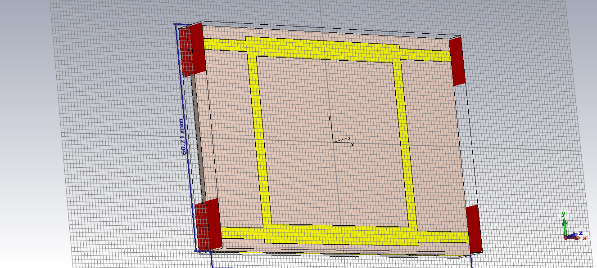
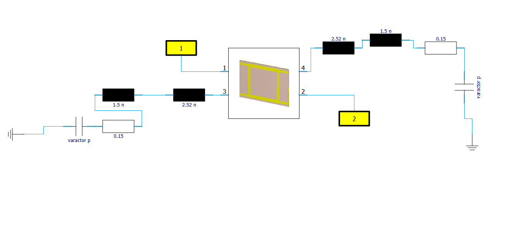
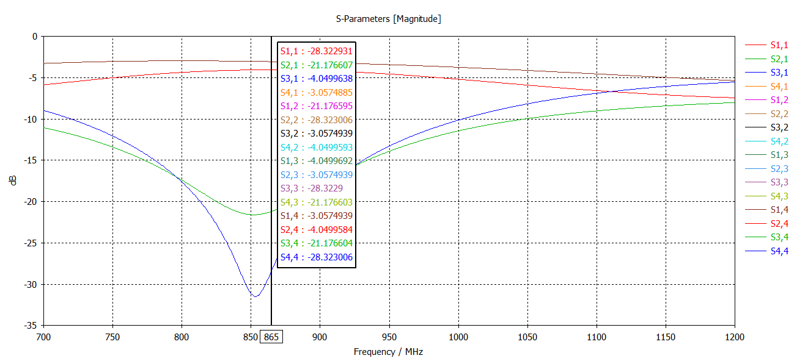
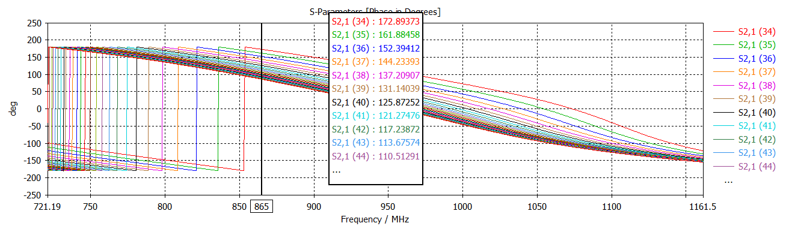

# Reflection-Type Phase Shifter (RTPS)

### CST Studio Suite | RF & Microwave Engineering | Phase Shifter Design

---

## Overview

This project presents the design and electromagnetic simulation of a **Reflection-Type Phase Shifter (RTPS)** using a coupler-based architecture.

The structure is developed and analyzed using **CST Studio Suite** to investigate its RF characteristics, phase response, and electromagnetic field distribution.

The project includes the CST electromagnetic model, coupler design, system schematic, S-parameter response, phase response, and an electric-field simulation from the input port.

---

## Objectives

- Design a reflection-type phase shifter using a coupler-based architecture.
- Develop the RF structure and phase-shifting network in CST Studio Suite.
- Analyze the simulated S-parameter response.
- Study the phase response of the structure.
- Visualize the electromagnetic field distribution.
- Provide a simulation framework for further RF optimization.

---

## Design Concept

A reflection-type phase shifter uses a reflection network connected through a coupler to control the phase of the RF signal.

The general signal path can be represented as:

**RF Input → Coupler → Reflection Network → Coupler → RF Output**

The coupler and reflection network together form the phase-shifting structure.

---

## Design Methodology

**RF Architecture → Coupler Design → Phase-Shifting Network → CST Model → EM Simulation → S-Parameter Analysis → Phase Response**

---

## Simulation Tool

The complete electromagnetic structure was developed and simulated using:

- **CST Studio Suite**
- 3D electromagnetic simulation
- S-parameter analysis
- Phase response analysis
- Electromagnetic field visualization

---

## Coupler Design

The coupler forms the primary RF interface between the input/output ports and the reflection-type phase-shifting network.

---

## System Schematic

The overall architecture and signal path of the reflection-type phase shifter are represented in the schematic below.

---

## Simulation Results

### S11 Response

The simulated S11 response is used to evaluate the input reflection characteristics of the phase-shifter structure.

---

### Phase Response

The phase response is used to investigate the phase-shifting behavior of the designed structure.

---

## Electric Field Simulation

The electromagnetic field distribution through the structure is visualized using CST simulation.

### Electric field from port 1

[▶ View Electric Field from Port 1](results/radial coupler_with_ps_02.mp4)

The simulation video illustrates the propagation of the electromagnetic field through the structure when excited from Port 1.

---

